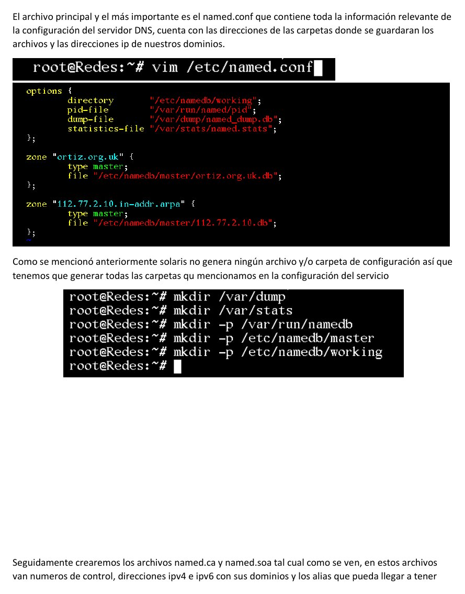
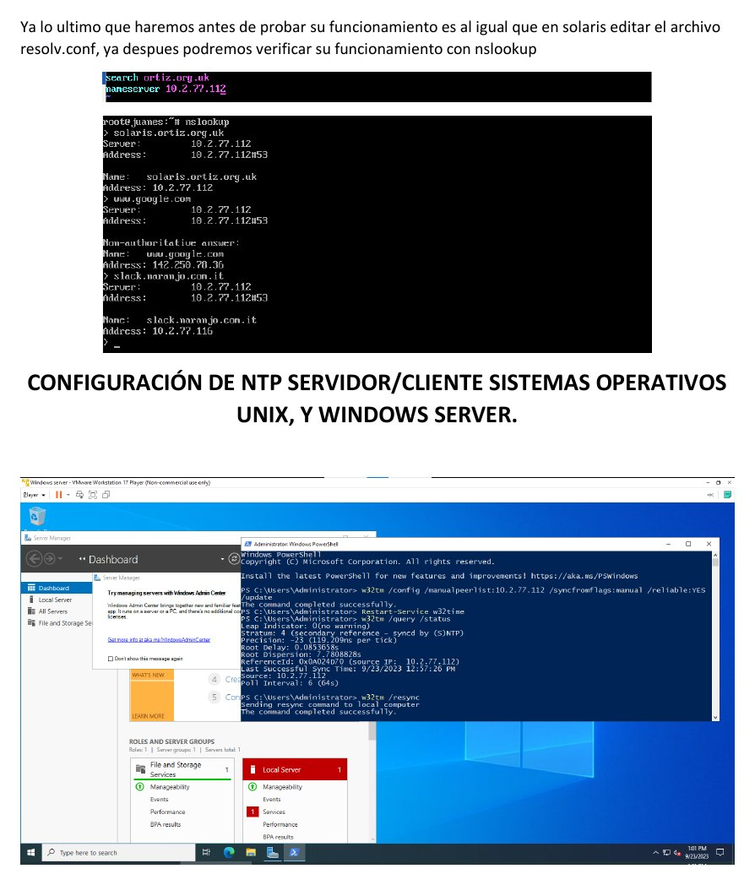
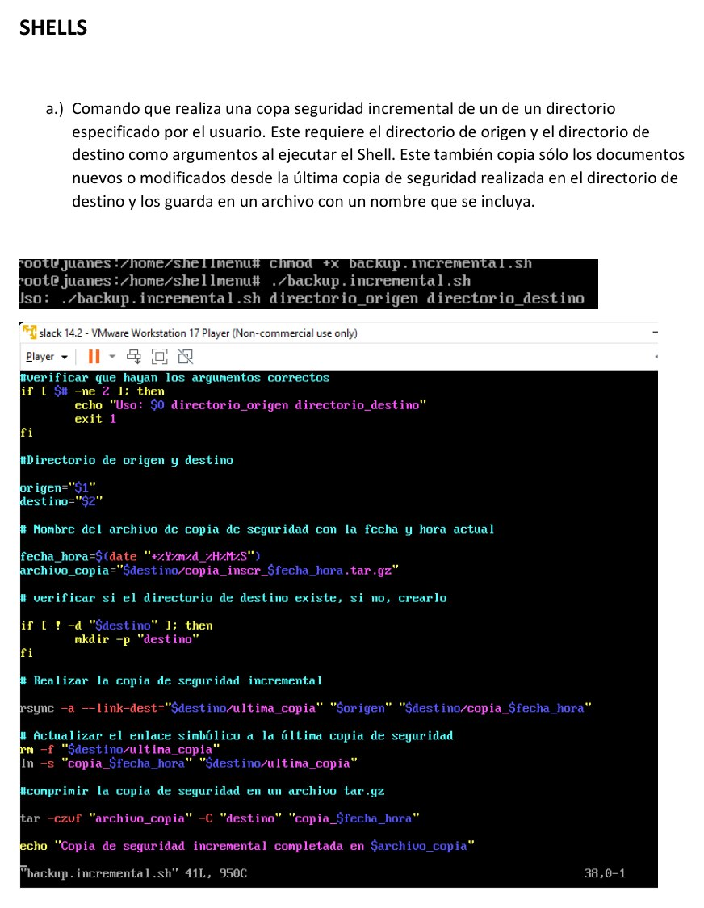

# Laboratorio 3 - Servicios DNS y NTP

**Autores:** Juan Esteban Ortiz Pastrana y Santiago Alberto Naranjo Abril  
**Institución:** Escuela Colombiana de Ingeniería Julio Garavito  
**Grupo:** 2  
**Fecha:** 23 de septiembre de 2023

## Objetivo

Configurar y administrar DNS y NTP en sistemas Unix y Windows Server. DNS permite traducir nombres de dominio a direcciones IP; NTP mantiene una referencia temporal coherente entre los equipos.

## Conceptos principales

### Registros DNS

| Registro | Función |
| --- | --- |
| A | Relaciona un nombre con una dirección IPv4 |
| AAAA | Relaciona un nombre con una dirección IPv6 |
| NS | Identifica el servidor responsable de la zona |
| MX | Define el servidor encargado del correo |
| CNAME | Crea un alias para otro nombre canónico |

También se estudian los dominios de nivel superior, servidores raíz y DNS dinámico.

### NTP

NTP sincroniza relojes mediante clientes y servidores organizados por estratos. El informe relaciona esta sincronización con la trazabilidad, el orden de los eventos y la integridad de los registros.

## Configuración de DNS

### Solaris

Se verificó la instalación de BIND y se construyó la configuración desde cero:

- `named.conf` para definir directorios, zonas y servidores.
- `named.ca` para referencias a servidores raíz.
- `named.soa` para datos de autoridad y control.
- `resolv.conf` para indicar dominio y servidor DNS.
- Archivos de hosts para direcciones IPv4, IPv6 y alias.

La resolución se comprobó mediante `nslookup`. Como `resolv.conf` no conservaba los cambios después de reiniciar Solaris, se aplicaron comandos del servicio para hacer persistente la configuración.

### Slackware

En Slackware los archivos base son generados al instalar BIND. Se modificaron para definir servidor maestro, posible servidor esclavo, servidores raíz y el dominio de trabajo. La validación también se realizó con `nslookup`.

## Configuración de NTP

Se prepararon servidores y clientes NTP en Unix y Windows Server. Las pruebas permiten verificar que los equipos consulten una referencia común y mantengan sus relojes sincronizados.

## Shells de administración

El informe incluye tres ejercicios:

1. Copia incremental de un directorio, conservando únicamente archivos nuevos o modificados.
2. Menú para listar, buscar, finalizar y reiniciar procesos.
3. Búsqueda de archivos por extensión con selección para abrirlos en un visor.

## Conclusiones

DNS es una pieza fundamental de Internet porque permite acceder a servicios mediante nombres fáciles de recordar en lugar de direcciones numéricas. NTP aporta coherencia temporal: asegura que registros, eventos y transacciones se almacenen con una referencia confiable, aspecto esencial para seguimiento y auditoría.

## Informe y evidencias

- [Informe completo en PDF](laboratorio-03-servicios-dns-y-ntp.pdf)
- `Laboratorio No 3.docx`
- `Lab 3.mp4`
